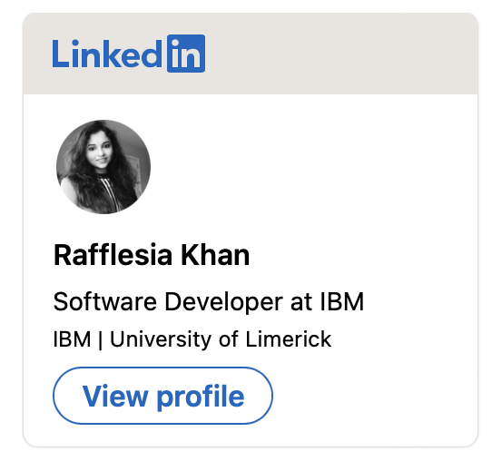

### Hi | আশা করি আপনি ভালো আছেন | ٱلسَّلَامُ عَلَيْكَ | Haigh GitHub 👋

  
    
  <samp>
I'm Rafflesia Khan. A Software Developer at IBM, Dublin. In my previous career, I have worked as a Teaching Assistant Lecturer, Trainer, and Research Scientist. I always like to learn more, try out different things, challenge myself, and contribute toward the betterment.
    

              

About Me:

- 🔭 Current Job: I’m currently working with IBM Process Mining team as a Software Developer. 
- 📚 Current learning: Currently I'm learning AWS, IBM Cloud, Foundation models and so on...
- 👯 Collaborate: I’m looking to collaborate on different open source projects.
- 🌱 Contribution to environment: Planting trees, recycling, cleaning, reusing, trying to manage rubbish as much as i can.
- 😎 Hobbies: Music, paint, cycling, eat, watch tv....
- ⚡ Fun fact: When I feel too tense, I laugh.H
-->
